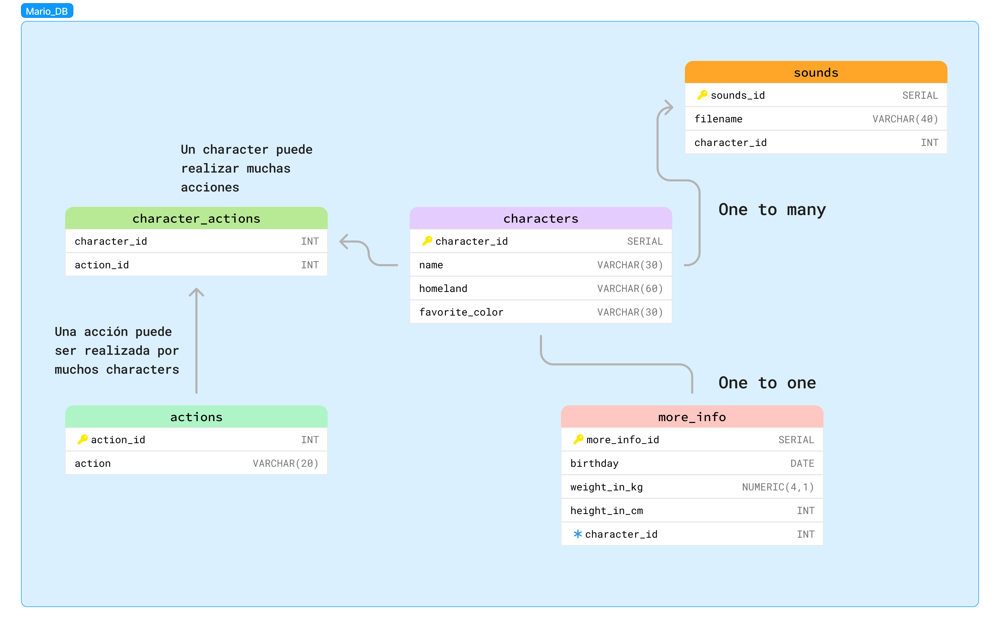

# MARIO BROS DATABASE

## Description
In this project I show my firts experience working with PSQL, this is a FreeCodeCamp project that explains the basics of PSQL and relational databases. 

## Requirements
- PostgreSQL (version 16 or higher)
- Database administration tools (SQL Shell, PowerShell.)

## ER Diagram

  
  
Diagrama de Entidad-Relación del proyecto Mario Bros

## Scripts SQL

