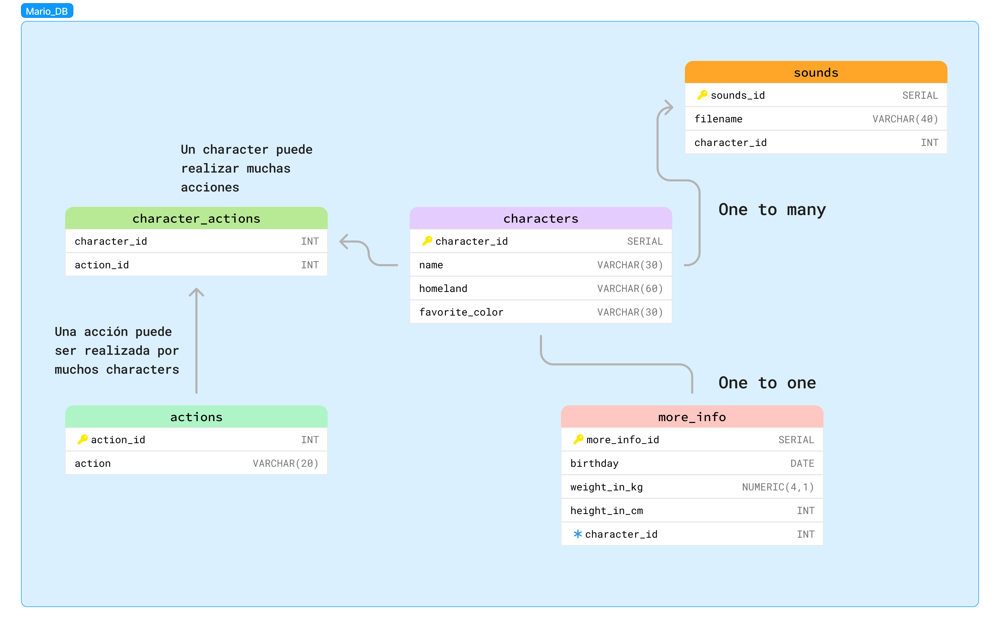

# MARIO BROS DATABASE

## DESCRIPTION
Este proyecto documenta el proceso de diseño y creación de una base de datos relacionada con el universo de Mario Bros. Incluye la estructura de las tablas, relaciones entre entidades y otros detalles relevantes.

## Requisitos
- PostgreSQL (versión 16 o superior)
- Herramientas de administración de bases de datos (SQL Shell, PowerShell.)

## Diagrama de Entidad-Relación (ER)

### Relaciones

#### Relación One-to-Many (characters - items)
- `characters.character_id` -> `items.character_id`

Describe aquí las relaciones entre las tablas y cómo están estructuradas.

## Scripts SQL

